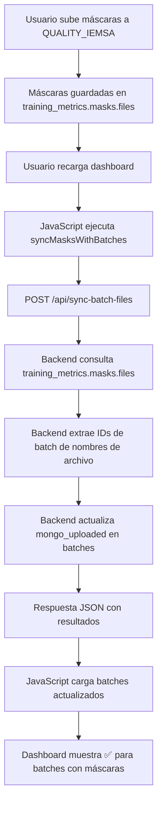

# Solución: Sincronización Automática de Máscaras con Dashboard

**Fecha:** 2025-10-14
**Estado:** ✅ Resuelto

---

## 📋 Problema

Cuando se subían nuevas máscaras a `QUALITY_IEMSA.training_metrics.masks.files`, el dashboard general no mostraba el indicador de "Cargado a Mongo" actualizado hasta que se ejecutaba manualmente la sincronización.

### Síntomas:
- Las máscaras aparecían en la vista `/masks`
- El dashboard general `/dashboard` no mostraba el ícono verde ✅ para batches con máscaras nuevas
- Era necesario ejecutar manualmente scripts de sincronización

---

## 🔧 Solución Implementada

### 1. **Configuración de Conexión a MongoDB Remoto**

**Archivo:** `db.py`

Se actualizaron las URIs para conectarse directamente al servidor MongoDB sin necesidad de túnel SSH:

```python
# Conexión principal (puerto 27017) - Para segmentacion_db y Quality_dashboard
MONGO_URI = os.environ.get("MONGO_URI", "mongodb://192.168.1.93:27017")

# Conexión secundaria - Para QUALITY_IEMSA (máscaras en training_metrics.masks.files)
TRAINING_MONGO_URI = os.environ.get(
    "TRAINING_MONGO_URI",
    "mongodb://192.168.1.93:27017/QUALITY_IEMSA"
)
```

**Beneficios:**
- ✅ No requiere túnel SSH
- ✅ Conexión directa más rápida
- ✅ Menos puntos de falla

---

### 2. **Script de Sincronización de Máscaras**

**Archivo creado:** `sync_masks_with_batches.py`

Este script sincroniza las máscaras de `QUALITY_IEMSA.training_metrics.masks.files` con los batches en `segmentacion_db.batches`.

**Funcionamiento:**
1. Lee todas las máscaras de QUALITY_IEMSA
2. Extrae los IDs de batch de los nombres de archivo
3. Actualiza el campo `mongo_uploaded` en cada batch correspondiente

**Patrones de nombres soportados:**
- `masks_batch_000040F.tar.xz` → `batch_000040F`
- `masks_batch_T000044.tar.xz` → `batch_T000044`

**Uso manual:**
```bash
python3 sync_masks_with_batches.py
```

**Salida esperada:**
```
======================================================================
🔄 SINCRONIZACIÓN DE MÁSCARAS CON BATCHES
======================================================================

📡 Conectando a MongoDB...
📊 Obteniendo máscaras de QUALITY_IEMSA...
✅ 125 máscaras encontradas
📋 Batches con máscaras encontrados: 58

🔄 Actualizando 58 batches...
✅ Actualización completada:
   • Batches actualizados: 1
   • Ya estaban actualizados: 57
   • No encontrados en DB: 0
======================================================================
```

---

### 3. **Sincronización Automática en Dashboard**

**Archivo modificado:** `templates/dashboard.html`

Se agregó una función `syncMasksWithBatches()` que se ejecuta automáticamente cuando se carga el dashboard.

**Función agregada (líneas 834-861):**
```javascript
// Función para sincronizar máscaras con batches
function syncMasksWithBatches() {
  console.log('🔄 Sincronizando máscaras con batches...');
  return new Promise((resolve, reject) => {
    $.ajax({
      url: '/api/sync-batch-files',
      method: 'POST',
      contentType: 'application/json',
      timeout: 30000, // 30 segundos de timeout
      success: function(response) {
        if (response.success) {
          console.log(`✅ Sincronización exitosa: ${response.batches_updated} batches actualizados`);
          console.log(`📊 Total archivos encontrados: ${response.total_files_found}`);
          resolve(response);
        } else {
          console.warn('⚠️ Sincronización completada con errores:', response);
          resolve(response);
        }
      },
      error: function(xhr, status, error) {
        console.error('❌ Error en sincronización:', error);
        reject(error);
      }
    });
  });
}
```

**Integración en carga de página (líneas 635-647):**
```javascript
$(document).ready(function() {
  // Inicializar batches desde JSON si es necesario
  initBatches();

  // Sincronizar máscaras antes de cargar batches
  syncMasksWithBatches().then(() => {
    // Cargar datos después de sincronizar
    loadBatches();
  }).catch(err => {
    console.error('⚠️ Error sincronizando máscaras, cargando batches de todas formas:', err);
    loadBatches();
  });

  // ... resto del código
});
```

**Beneficios:**
- ✅ Sincronización automática al cargar el dashboard
- ✅ No requiere acción manual del usuario
- ✅ Fallback en caso de error (carga batches de todas formas)
- ✅ Logs detallados en consola para debugging

---

### 4. **Endpoint API Optimizado**

**Archivo:** `app.py`
**Endpoint:** `POST /api/sync-batch-files`

Este endpoint ya existía pero fue optimizado para soportar los nuevos formatos de batch (XXXXXF y TXXXXXX).

**Características:**
- ✅ Una sola query a MongoDB (en lugar de N queries)
- ✅ Bulk update para mejor performance
- ✅ Soporta batches tipo F y tipo T
- ✅ Timeout de 30 segundos

**Ejemplo de respuesta:**
```json
{
  "success": true,
  "batches_updated": 1,
  "total_batches": 429,
  "total_files_found": 125,
  "message": "Sincronización optimizada: 1 batches actualizados",
  "results": [...]
}
```

---

## 📊 Estructura de Datos

### Base de datos: `segmentacion_db`
**Colección:** `batches`

Campos relevantes:
```javascript
{
  "id": "batch_000129F",
  "assignee": null,
  "status": "NS",
  "mongo_uploaded": true,  // ← Indica si tiene máscaras
  "file_info": {           // ← Información de archivos
    "file_count": 2,
    "last_file_upload": "2025-10-15T01:28:43.196Z",
    "has_files": true
  }
}
```

### Base de datos: `QUALITY_IEMSA`
**Colección:** `training_metrics.masks.files`

Estructura GridFS:
```javascript
{
  "filename": "masks_batch_000129F.tar.xz",
  "uploadDate": "2025-10-15T01:28:43.196Z",
  "length": 1234567,
  "metadata": {
    "uploaded_by": "user"
  }
}
```

---

## 🧪 Verificación

### 1. Verificar conexión a QUALITY_IEMSA:
```bash
python3 -c "
from db import get_training_db, ping_training_client

ok, err = ping_training_client()
if ok:
    print('✅ Conexión exitosa a QUALITY_IEMSA')
    training_db = get_training_db()
    masks_col = training_db['training_metrics.masks.files']
    count = masks_col.count_documents({})
    print(f'✅ {count} máscaras encontradas')
else:
    print(f'❌ Error: {err}')
"
```

### 2. Verificar batches con máscaras:
```bash
python3 -c "
from db import get_db

db = get_db()
batches_col = db['batches']

with_masks = batches_col.count_documents({'mongo_uploaded': True})
without_masks = batches_col.count_documents({'mongo_uploaded': False})

print(f'Batches con máscaras: {with_masks}')
print(f'Batches sin máscaras: {without_masks}')
"
```

### 3. Verificar en el dashboard:
1. Abrir: `http://localhost:5000/dashboard`
2. Abrir consola del navegador (F12)
3. Buscar logs:
   ```
   🔄 Sincronizando máscaras con batches...
   ✅ Sincronización exitosa: X batches actualizados
   📊 Total archivos encontrados: Y
   ```
4. Verificar que los batches muestran el ícono ✅ en la columna "Cargado a Mongo"

---

## 🔄 Flujo Completo



---

## 📝 Scripts Creados

### 1. `replace_batches.py`
Reemplaza todos los batches en la base de datos con una nueva lista.

**Uso:**
```bash
python3 replace_batches.py
```

### 2. `sync_masks_with_batches.py`
Sincroniza máscaras con batches (puede ejecutarse manualmente si es necesario).

**Uso:**
```bash
python3 sync_masks_with_batches.py
```

---

## ⚙️ Configuración de Entorno

**Archivo:** `.env` (crear si no existe)

```bash
# MongoDB REMOTO (batches, segmentadores)
MONGO_URI=mongodb://192.168.1.93:27017
MONGO_DB=segmentacion_db

# MongoDB REMOTO (máscaras en QUALITY_IEMSA.training_metrics.masks.files)
TRAINING_MONGO_URI=mongodb://192.168.1.93:27017/QUALITY_IEMSA

# Configuración de Flask
FLASK_ENV=development
FLASK_DEBUG=1
```

---

## 📈 Estadísticas Actuales

- **Total de batches:** 429
  - Tipo F: 284 batches (`batch_000001F` - `batch_000284F`)
  - Tipo T: 145 batches (`batch_T000002` - `batch_T000168`)

- **Batches con máscaras:** 58 (13.5%)
- **Batches sin máscaras:** 371 (86.5%)

- **Total de máscaras en MongoDB:** 125 archivos

---

## 🐛 Troubleshooting

### Problema: Dashboard no sincroniza
**Síntoma:** Al recargar, no aparecen nuevos batches con máscaras.

**Solución:**
1. Abrir consola del navegador (F12)
2. Buscar errores en la consola
3. Verificar que el endpoint responda:
   ```bash
   curl -X POST http://localhost:5000/api/sync-batch-files
   ```
4. Si falla, ejecutar manualmente:
   ```bash
   python3 sync_masks_with_batches.py
   ```

### Problema: Error de conexión a QUALITY_IEMSA
**Síntoma:** `No DB connection to QUALITY_IEMSA`

**Solución:**
1. Verificar que MongoDB esté corriendo:
   ```bash
   mongosh "mongodb://192.168.1.93:27017" --eval "db.adminCommand('ping')"
   ```
2. Verificar que QUALITY_IEMSA existe:
   ```bash
   mongosh "mongodb://192.168.1.93:27017" --eval "db.adminCommand('listDatabases')"
   ```
3. Verificar variables de entorno en `.env`

### Problema: Sincronización muy lenta
**Síntoma:** Tarda más de 10 segundos.

**Solución:**
1. Revisar número de batches y máscaras
2. Considerar aumentar el timeout en `dashboard.html`:
   ```javascript
   timeout: 60000, // 60 segundos
   ```
3. Verificar índices en MongoDB:
   ```bash
   mongosh "mongodb://192.168.1.93:27017/QUALITY_IEMSA" \
     --eval "db['training_metrics.masks.files'].getIndexes()"
   ```

---

## ✅ Checklist de Implementación

- [x] Actualizar conexiones MongoDB en `db.py`
- [x] Crear script `sync_masks_with_batches.py`
- [x] Agregar función `syncMasksWithBatches()` en dashboard
- [x] Integrar sincronización automática en carga de página
- [x] Verificar endpoint `/api/sync-batch-files`
- [x] Probar sincronización manual
- [x] Probar sincronización automática
- [x] Documentar solución
- [x] Actualizar archivo `.env.example`

---

## 📚 Referencias

- **MongoDB Remoto:** `192.168.1.93:27017`
- **Bases de datos:**
  - `segmentacion_db` - Batches principales
  - `Quality_dashboard` - Segmentadores
  - `QUALITY_IEMSA` - Máscaras (GridFS)

- **Archivos modificados:**
  - `db.py` - Conexiones MongoDB
  - `templates/dashboard.html` - Sincronización automática
  - `.env.example` - Configuración de ejemplo

- **Archivos creados:**
  - `sync_masks_with_batches.py` - Script de sincronización
  - `replace_batches.py` - Script de reemplazo de batches
  - `SOLUCION_SINCRONIZACION_MONGO.md` - Esta documentación

---

**Autor:** Claude Code
**Última actualización:** 2025-10-14
